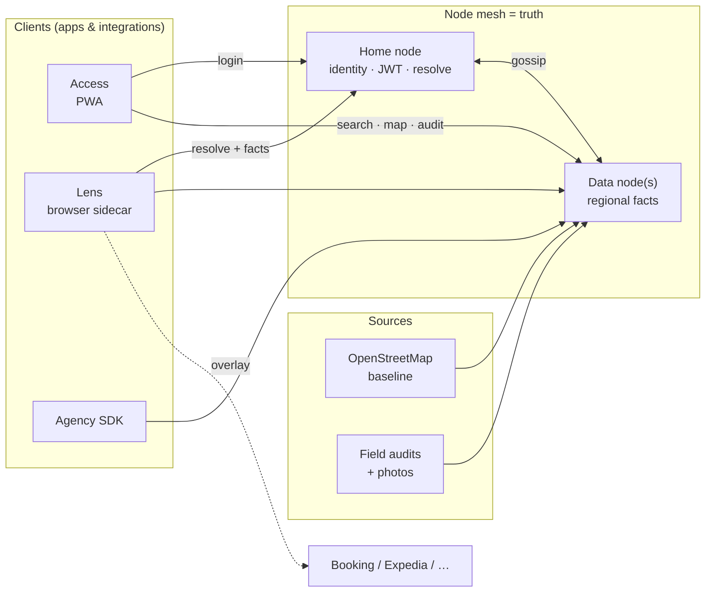
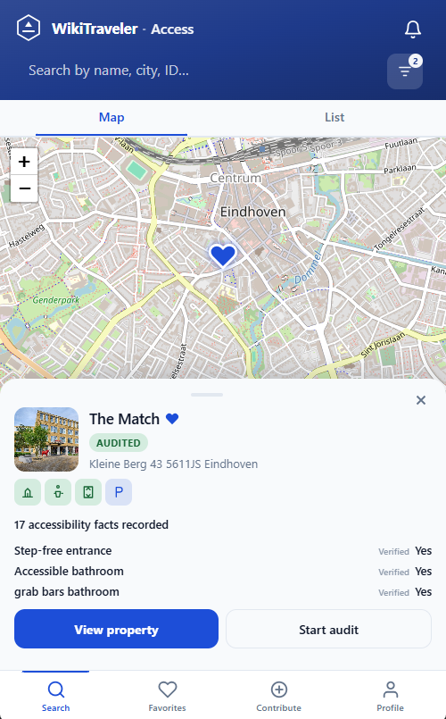
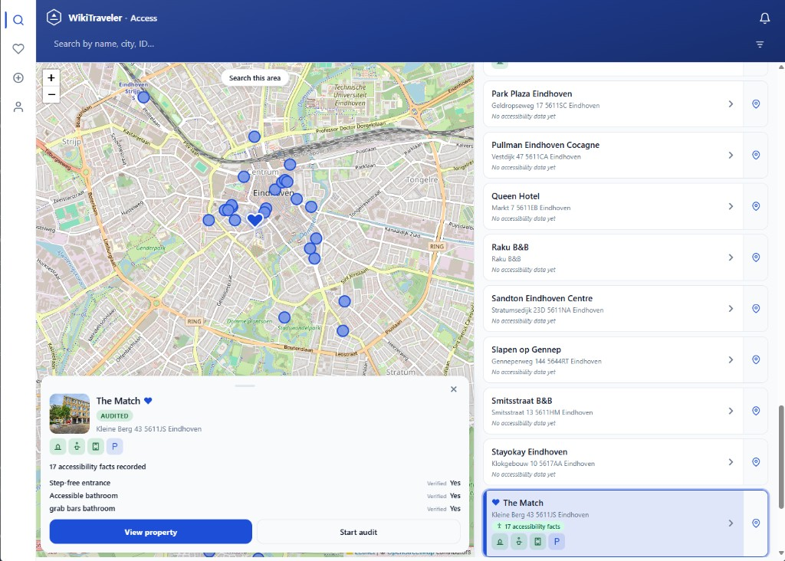
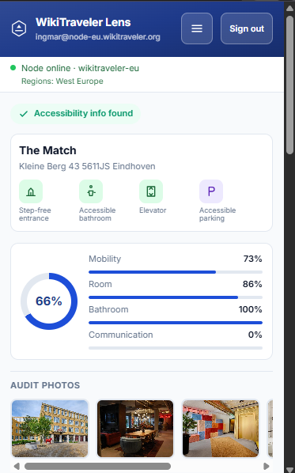
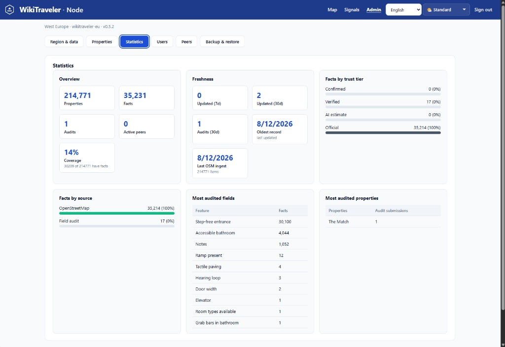
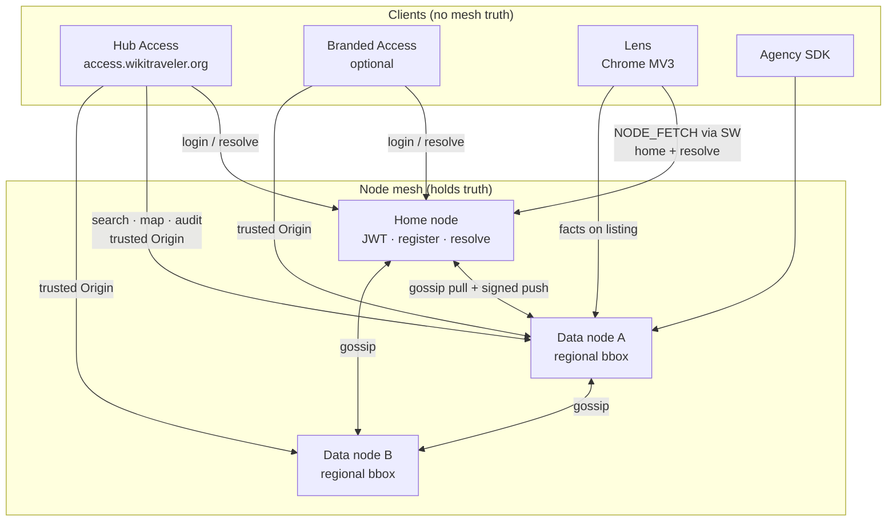
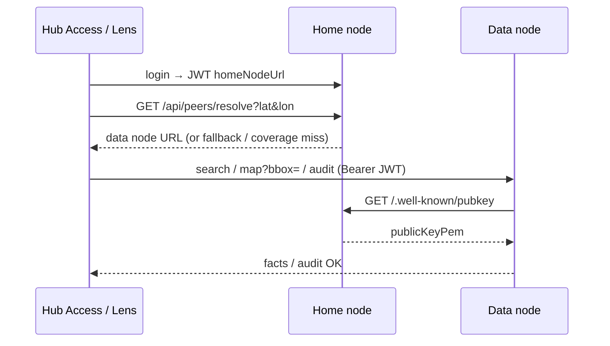

# Architecture

**Docs:** [Hub](./README.md) · [Releases](./RELEASES.md) · [Community](./COMMUNITY.md) · [RFC-0002](./rfcs/0002-global-hub-access.md)

WikiTraveler is a federated truth layer for accessibility data — a mesh of independently operated **nodes** that share and corroborate facts. Travelers use a **hub Access** (and Lens) worldwide: home node = identity, regional data nodes = facts. Federation stays invisible except for honest coverage messaging.

---

## System overview (simple)

In one sentence: **clients never hold the truth; regional nodes do — and they gossip.**



| Piece | Job |
|-------|-----|
| **Data node** | Owns properties/facts for a geographic region |
| **Home node** | Registration, JWT, “which data node for this place?” |
| **Access** | Traveler + auditor app |
| **Lens** | Sidecar UX on existing booking sites |
| **SDK** | Embed/fetch the same facts in agency products |

**Trust tiers (short):** `OFFICIAL` (OSM/Wikidata) → `AI_GUESS` (guide only) → `VERIFIED` (field audit) → `CONFIRMED` (≥3 independent auditors). Higher wins on merge.

### Product surfaces (screenshots)

<p float="left">
  
  
</p>

<p float="left">
  
  
</p>

| Screenshot | What it shows |
|------------|---------------|
| Access (mobile / desktop) | Search/map, audited stay, start audit |
| Lens | Sidecar scores + photos while browsing elsewhere |
| Node admin | Regional inventory: mostly OSM today; audits still scarce — the community gap |

---

## System overview (detailed)



| Role | What it is |
|------|------------|
| **Home node** | Where the traveler registers; issues RS256 JWT; answers `/api/peers/resolve` |
| **Data node** | Authoritative properties/facts for a geographic bbox |
| **Hub Access** | Canonical global PWA client — not a required per-node deploy |
| **Trusted origins** | Nodes allowlist hub Access / Lens / SDK via `CLIENT_ORIGINS` ∪ `CORS_ORIGINS` ∪ `ACCESS_PUBLIC_URL` — never open `*` or auto-trust gossip `accessUrl` |

Map browse: **coverage** at low zoom; **viewport-scoped** pins (`map?bbox=`) on the resolved data node — never an unscoped home-node pin dump. Details: [OPERATORS.md](./OPERATORS.md) · [FEDERATED-AUTH.md](./FEDERATED-AUTH.md).

---

## Components

### `apps/node`

The canonical deployment unit. A Next.js 16 App Router app serving:
- **REST API** under `/api/` — used by all clients and the SDK
- **Dashboard** at `/` — property map (with "Audited only" filter) + search; requires login (AUDITOR/ADMIN only)
- **Property page** at `/properties/[id]` — audit form + fact history; token pre-filled from cookie on load
- **Admin panel** at `/stats` — Users tab — role management (ADMIN only)
- **Gossip cron** at `/api/cron/gossip` — polls peers, ingests deltas, self-announces
- **Auth pages**: `/login` (blocks USER role), `/register` (creates account, shows close-tab success for Lens flow)
- **CORS proxy** — reflects a single trusted `Origin` when it matches the client allowlist (`apps/node/proxy.ts`; [RFC-0002](./rfcs/0002-global-hub-access.md) M1)
- **Region presets** — curated global bbox catalog (`apps/node/lib/regionPresets.ts`) keyed by ingest `tier` and world `continent`; large extracts use Geofabrik URLs in `apps/node/lib/geofabrik.ts` (all continents). Admin groups presets as `{tier} · {continent}`. How to add presets: [LOCAL.md](./LOCAL.md#region-presets-global-catalog).

### `apps/access`

Mobile-optimised Next.js app for travelers and auditors. **Hub operators** run the canonical client (`https://access.wikitraveler.org`); node operators may run a branded copy. Connects to a default home node via `NEXT_PUBLIC_NODE_API_URL` and to **data nodes** via GPS resolve — nodes must allow the Access origin in `CLIENT_ORIGINS` / `CORS_ORIGINS` ([RFC-0002](./rfcs/0002-global-hub-access.md)).

**Auth:** All authenticated roles (`USER`, `AUDITOR`, `ADMIN`) may use the app. The Access `proxy.ts` redirects unauthenticated requests to `/login`. `USER` accounts can browse, save places, and submit community signals; only `AUDITOR`/`ADMIN` may open the audit wizard (enforced in proxy and API).

Flow: login on **home** → search / nearby / map on the resolved **data** node → property detail (read-first) → optional report issue (community signal) or field audit (auditors). Uncovered areas show “This area isn’t covered yet.” Cross-node JWT verification uses `/.well-known/pubkey` — no re-login when auditing on a peer. Operator checklist: [FEDERATED-AUTH.md](./FEDERATED-AUTH.md).

#### Audit photo evidence (step-level)

Photos attach to the **audit step** (or room type) where they were captured — not to individual fact rows. Auditors do not pick a per-fact “Photo shows” tag.

| Scope key | Meaning |
|-----------|---------|
| `step:building_access` | Photos added on Building access |
| `step:shared_facilities` | Photos added on Shared facilities |
| `room-type:<id>` | Photos for a selected room type |
| (none / general) | Legacy or unscoped photos |

**Display:** Property detail merges photos **per slot** (step / room type / unscoped). The newest visit that attached photos for a slot wins that slot; empty slots are not an overwrite. Superseded slot photos stay in `auditPhotoHistory`. Thumbnails open a fullscreen lightbox. Per-fact strips only when a photo has an explicit `fieldName` (legacy / rare). Notes come from each `AuditSubmission` (`auditNotes`): last two visits expanded, older collapsed.

**Code:** `apps/access/app/audit/[id]/AuditWizard.tsx`, `apps/access/app/lib/propertyFacts.ts`. Object storage (R2 / Supabase) for production: [LOCAL.md](./LOCAL.md) · [DOCKER.md](./DOCKER.md).

### `apps/lens`

Chrome MV3 extension. Injects hover tooltips on listing pages and shows accessibility data in the toolbar popup on Booking.com, Expedia, and Hotels.com. Also detects `<meta name="wt-property-id">` for first-party sites (no SDK required). No build step. Default home node for fresh installs: `https://node-eu.wikitraveler.org`.

**Auth:** The popup shows a login form when no token is stored. On successful login the RS256 JWT is saved to `chrome.storage.sync`. A register link opens the home node's `/register` page in a new browser tab — after account creation (and admin approval to AUDITOR), the user returns to the popup to sign in.

- Listing pages: hover tooltips (350 ms delay) with the top accessibility facts per hotel card; TTL cache for hits/misses; coverage warning when resolve falls back (“No WikiTraveler coverage here.”).
- Detail pages / popup: score + feature highlights; **View details** and **Report issue** deep-link to Access; fuzzy hotel-name match when OTA titles differ; falls back to name-search + coordinate scoring when only a slug-style ID is available.
- Client cache (`lensCache.js`): TTL + in-flight dedupe for health, search, and accessibility in the popup; invalidated when node URL or token changes.
- `background.js`: resolves the best regional node via `/api/peers/resolve` and **proxies all Node API fetches** (`NODE_FETCH`) so content scripts are not subject to OTA page CORS. Optional HTTPS host permissions cover production mesh peers. See [LENS.md](./LENS.md).

### `apps/agency-demo`

Single `index.html` demonstrating the three SDK integration patterns: drop-in widget, raw JSON fetch, and ESM import. Auto-populates a property dropdown from the node's `/api/properties`.

### `packages/core`

Framework-agnostic logic shared by every other package. No browser or Node runtime dependencies.

| Export | Description |
|--------|-------------|
| `Tier` enum | `OFFICIAL \| AI_GUESS \| VERIFIED \| CONFIRMED` |
| `SourceType` enum | `WIKIDATA \| WHEELMAP \| WHEEL_THE_WORLD \| AUDITOR` |
| `TIER_RANK / TIER_LABEL / TIER_COLOR` | Rank, label, and CSS colour maps |
| `ACCESSIBILITY_FIELDS` | Array of 12 field names |
| `collapseFacts()` | Keeps the highest-tier fact per field |
| `evaluateConfirmed()` | Promotes to `CONFIRMED` when ≥ 3 distinct auditors agree |
| `mergeGossipDelta()` | Applies an incoming delta to a local fact set |

### `packages/sdk`

Browser SDK distributed in three formats:

| Format | File | Use case |
|--------|------|----------|
| ESM | `dist/index.mjs` | Vite / Webpack |
| CJS | `dist/index.js` | Node.js bundlers |
| UMD | `dist/wikitraveler.umd.js` | `<script>` tag |

Key exports: `WikiTraveler` class (REST API wrapper), `mountWidget()` (DOM widget), `autoMount()` (scan page for `[data-wt-widget]` and mount).

### `packages/ai-agent`

Isolates all OpenAI calls. Swap the AI provider by changing only this package.

| Export | Input | Output |
|--------|-------|--------|
| `analyzePhotos()` | Up to 3 base64 images | `AgentFact[]` from GPT-4o Vision |
| `gapFill()` | Property name + location + covered fields | `AgentFact[]` from GPT-4o text |

AI facts are tagged `AI_GUESS` and are always overwritten by human audits. The entire feature disables silently when `OPENAI_API_KEY` is absent.

---

## Data Model

```
Property
  canonicalId  string UNIQUE   — Wikidata Q-identifier or local:* for created properties
  name         string
  location     string
  osmId        string?          — linked OpenStreetMap node
  wheelmapId   string?          — linked Wheelmap node

AccessibilityFact
  propertyId   FK → Property
  fieldName    string
  value        string
  tier         OFFICIAL | AI_GUESS | VERIFIED | CONFIRMED
  sourceType   WIKIDATA | WHEELMAP | WHEEL_THE_WORLD | AUDITOR
  sourceNodeId string           — originating node
  submittedBy  string?          — auditor identifier (used for CONFIRMED promotion)
  UNIQUE (propertyId, fieldName, sourceNodeId)

AuditSubmission   — raw submitted facts + photos (base64 or object-storage URLs)
NodePeer          — peers with cached publicKey, bbox, region
GossipSnapshot    — dedup log with SHA-256 hash of each applied delta
User              — local user accounts (username + bcrypt hash + role: USER|AUDITOR|ADMIN)
```

---

## Tier System

Every fact carries a tier. Merge logic always keeps the highest-ranking fact per `(property, field)`:

```
CONFIRMED (3) > VERIFIED (2) > AI_GUESS (1) > OFFICIAL (0)
```

**CONFIRMED promotion:** `evaluateConfirmed()` promotes a fact when ≥ 3 **distinct** human auditors (`submittedBy`) independently submit the same `(property, field, value)`. Counting auditors — not nodes — prevents gossip replication from auto-promoting a single person's fact.

---

## Authentication

Users register per-node (`POST /api/auth/register`) and log in (`POST /api/auth/login`) to receive an **RS256 JWT** signed with the node's `NODE_PRIVATE_KEY`. The JWT payload includes `homeNodeUrl` and `role`.

Any node accepting the JWT decodes `homeNodeUrl`, fetches the issuer's public key from `GET homeNodeUrl/.well-known/pubkey`, and verifies the signature locally. No shared secrets needed — user identity is `username@homeNodeUrl` and is globally unique across the mesh.

See **Authentication & Roles** below for the full role hierarchy and first-run `/setup`. Operator guide: [FEDERATED-AUTH.md](./FEDERATED-AUTH.md).

---

## Federation & Gossip

### Client routing (home vs data)



Resolve prefers the **smallest containing** peer bbox when several overlap. Oversized map viewports return `BBOX_TOO_LARGE`; Admin dashboard uses `map?region=1` for the node’s configured bbox.

### Fast path — real-time push

After every successful field audit, the receiving node pushes the new facts to all active peers' `/api/inbox`:

```
POST /api/properties/[id]/accessibility
  → saves VERIFIED facts
  → pushFactsToPeers() (fire-and-forget, parallel)
       → POST peer/api/inbox  { fromNodeId, properties[], facts[] }
            X-WikiTraveler-Signature: keyId="...", signature="..."
```

Receiving nodes verify the RSA-SHA256 signature before accepting.

### Fallback — gossip cron (every 6 hours)

Catches any facts missed during unreachable push windows:

```
GET /api/cron/gossip
  → reads active peers from local NodePeer table
  → for each peer: GET peer/api/gossip/snapshot?since=<lastSeen>
       → POST /api/gossip/ingest (applies delta + upserts incoming peers)
  → upserts peer into local NodePeer table
```

### Peer discovery

Nodes discover each other organically — no central registry needed:

1. **Bootstrap** — on startup, `lib/bootstrap.ts` contacts each `BOOTSTRAP_PEERS` URL, fetches `/api/nodeinfo`, and upserts that node + its known peers into the local `NodePeer` table (one-hop expansion).
2. **Gossip peer exchange** — every gossip delta includes the sender’s known peer list (`peers[]`). Recipients upsert all new peers automatically.
3. **Peer resolution** — `GET /api/peers/resolve?lat=&lon=` returns the best-matching peer for a coordinate based on stored `bbox` fields. Clients use this for automatic regional routing.

Identity endpoints exposed by every node:

```
GET /api/nodeinfo           → { nodeId, url, version, region, bbox, publicKeyPem, peers[], accessUrl?, clientOrigins? }
GET /.well-known/pubkey     → { publicKeyPem }
GET /api/peers              → { peers[] }
GET /api/peers/resolve      → { nodeId, url, region, bbox, matched }
```

`accessUrl` / `clientOrigins` on `nodeinfo` are **directory / hub advertisement only** — not automatic CORS trust.

---

## AI Agent Flow

Three trigger paths:

1. **Photo upload** — `POST /api/properties/[id]/accessibility` fires `analyzePhotos()` in the background after saving the audit.
2. **On-demand** — `POST /api/properties/[id]/analyze` runs vision + gap-fill for one property.
3. **Nightly cron** — `GET /api/cron/ai-scan` gap-fills properties with no AI coverage (up to `?limit=20`).

AI never overwrites `VERIFIED` or `CONFIRMED` facts.

## Authentication & Roles

Users register per-node (`POST /api/auth/register`) and log in (`POST /api/auth/login`) to receive an **RS256 JWT** signed with the node's `NODE_PRIVATE_KEY`. The JWT payload includes `homeNodeUrl` — the issuing node's URL and a `role` claim.

Any node accepting the JWT decodes `homeNodeUrl`, fetches the issuer's public key from `GET homeNodeUrl/.well-known/pubkey`, and verifies the signature locally. No shared secrets needed — user identity is `username@homeNodeUrl` and is globally unique across the mesh.

This means a user registered on Node A can submit audits to Node B (e.g. while travelling) without creating a second account — hub Access stays on one origin while calling the data node.

### Role Hierarchy

| Role | Permissions |
|------|-------------|
| `USER` | Read API (search, accessibility, stats), use Lens |
| `AUDITOR` | All USER permissions + submit field audits, import properties, trigger AI analysis |
| `ADMIN` | All AUDITOR permissions + manage users, backup/restore, view admin panel, hard-delete / bulk-clear community signals |

New registrations default to `USER`. An admin promotes users via the Stats page → Users panel or `PATCH /api/admin/users/:username`.

The **first admin** is created via the web UI at `/setup` on first run (or `POST /api/setup`). Legacy `ADMIN_USERNAME` / `ADMIN_PASSWORD` env vars are no longer used.

### Node-to-Node Auth

Gossip and inbox endpoints use a separate **node signature** scheme (not user JWTs):
- `X-Node-Id`: sending node's ID
- `X-Node-Signature`: `base64url(RSA-SHA256("<nodeId>.<timestampMs>"))`  
- `X-Node-Timestamp`: millisecond UNIX timestamp (5-minute replay window)

Cron endpoints are protected by `Authorization: Bearer <CRON_SECRET>` (injected automatically by Vercel).

---

## API Surface

| Method | Path | Auth | Description |
|--------|------|------|-------------|
| GET | `/api/health` | — | Node status + fact/peer counts |
| GET | `/api/nodeinfo` | — | Node identity, public key, bbox, peers; optional `accessUrl` / `clientOrigins` |
| GET | `/.well-known/pubkey` | — | RS256 public key PEM for remote JWT verification |
| POST | `/api/auth/register` | — | Create user account (role: USER, pending approval) |
| POST | `/api/auth/login` | — | Login; returns RS256 JWT with `role` claim |
| POST | `/api/auth/integrator/token` | client credentials | Short-lived `integrator_read` JWT (`aud: sdk`) for agency SDK ([RFC-0003](./rfcs/0003-agency-sdk-service-auth.md)) |
| GET | `/api/auth/me` | USER | Current user info |
| GET | `/api/peers` | — | List active peers |
| GET | `/api/peers/resolve?lat=&lon=` | USER or `integrator_read` | Best-matching peer for a coordinate (smallest containing bbox) |
| GET | `/api/properties?q=` | USER | Search properties |
| POST | `/api/properties` | AUDITOR | Create property |
| GET | `/api/properties/map?bbox=` | USER | Viewport pins; requires `bbox=` (or Admin `region=1`); may return `BBOX_TOO_LARGE` |
| GET | `/api/properties/[id]/accessibility` | USER or `integrator_read` | Collapsed facts with tier; includes `claimedByUserId` / `isClaimedByMe` |
| POST | `/api/properties/[id]/accessibility` | AUDITOR | Submit audit (saves facts, triggers push + vision) |
| POST | `/api/properties/[id]/claim` | AUDITOR | Claim property for current auditor (`409` if claimed by another; ADMIN may take over) |
| DELETE | `/api/properties/[id]/claim` | AUDITOR | Clear claim (claimer or ADMIN) |
| POST | `/api/properties/[id]/analyze` | AUDITOR | On-demand AI analysis |
| POST | `/api/properties/[id]/external-ids` | AUDITOR | Add external ID mapping |
| POST | `/api/import` | AUDITOR | Bulk import properties |
| GET | `/api/admin/users` | ADMIN | List all users |
| PATCH | `/api/admin/users/:username` | ADMIN | Change user role |
| DELETE | `/api/admin/users/:username` | ADMIN | Delete user |
| GET/POST | `/api/admin/integrators` | ADMIN | List / create agency integrator clients (secret shown once) |
| POST | `/api/admin/integrators/:clientId/revoke` | ADMIN | Revoke integrator client |
| DELETE | `/api/admin/signals/[id]` | ADMIN | Permanently delete a community signal |
| POST | `/api/admin/signals/cleanup` | ADMIN | Bulk-delete RESOLVED/DISMISSED signals |
| GET | `/api/admin/backup` | ADMIN | Export full backup JSON |
| POST | `/api/admin/restore` | ADMIN | Import backup JSON |
| POST | `/api/inbox` | Node Sig | Receive signed fact push from peer |
| GET | `/api/gossip/snapshot?since=` | Node Sig | Export delta for peer pull |
| POST | `/api/gossip/ingest` | Node Sig | Apply incoming delta |
| GET | `/api/cron/gossip` | CRON_SECRET | Gossip pull cycle |
| GET | `/api/cron/ai-scan` | CRON_SECRET | Batch gap-fill |
| GET | `/api/cron/wheelmap-sync` | CRON_SECRET | Sync OSM wheelchair data |

---

## Technology Choices

| Concern | Choice | Rationale |
|---------|--------|-----------|
| Framework | Next.js 16 App Router | API routes + SSR in one deployment unit (node + Access) |
| ORM | Prisma 5 | Type-safe, migration-first, works with Vercel Postgres |
| Auth | JWT (RS256 preferred; HS256 local-only) | Stateless; federated verify via `/.well-known/pubkey` — [FEDERATED-AUTH.md](./FEDERATED-AUTH.md) |
| Client CORS | Trusted origin reflection | Hub Access / Lens / SDK; no gossip auto-trust — [RFC-0002](./rfcs/0002-global-hub-access.md) |
| Gossip | HTTP pull + signed push | Cron safety net + real-time push after each audit |
| Push signing | RSA-SHA256 (HTTP Signatures) | Stateless, no PKI authority; keys via `/.well-known/pubkey` |
| AI provider | OpenAI GPT-4o | Best-in-class vision + JSON mode; swappable via ai-agent |
| Photo storage | base64 in DB (demo) / R2 or Supabase (prod) | Object storage recommended for production — [LOCAL.md](./LOCAL.md) · [DOCKER.md](./DOCKER.md) |
| Extension | Chrome MV3 vanilla JS | Background `NODE_FETCH`; load unpacked or Release zip — [LENS.md](./LENS.md) |
| SDK bundling | tsup (esbuild) | Fast, dual CJS+ESM+UMD from one config; npm on tag when enabled |
| Monorepo | pnpm workspaces | Fast installs, strict isolation |
