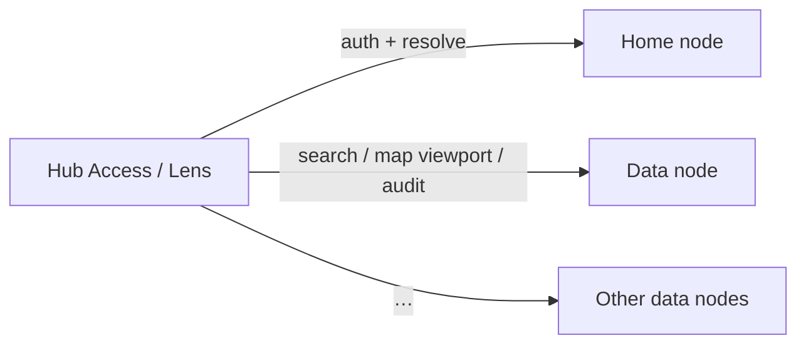
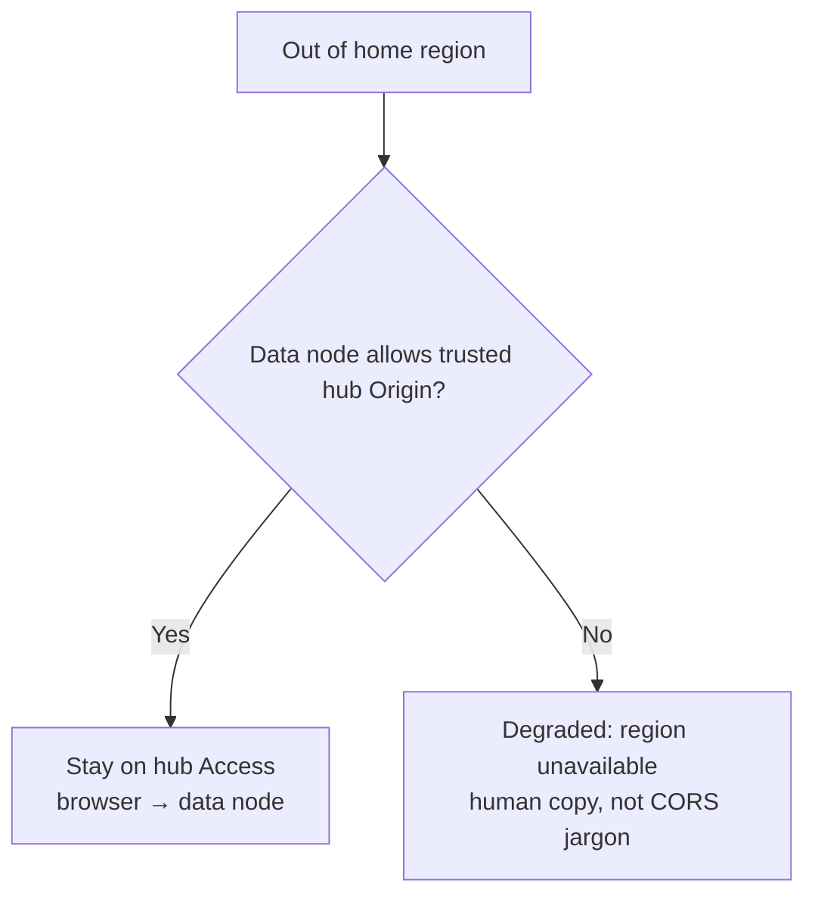

# RFC-0002: Global hub Access & Lens (federation invisible)

**Status:** Accepted (`rfc/accepted`; tracking [#51](https://github.com/ingmarstruijs/WikiTraveler/issues/51) closed)  
**Area:** Auth trust / Access·Lens peer resolve / operator CORS / map API  
**Canonical hub (intended):** `https://access.wikitraveler.org` (domain owned by project)  
**Tracking issue:** [#51](https://github.com/ingmarstruijs/WikiTraveler/issues/51) — M1–M5 landed ([#50](https://github.com/ingmarstruijs/WikiTraveler/pull/50)–[#55](https://github.com/ingmarstruijs/WikiTraveler/pull/55)). Follow-ons: GitHub issues.  
**Related:** [FEDERATED-AUTH.md](../FEDERATED-AUTH.md) · [PUBLIC-PEERS.md](../PUBLIC-PEERS.md) · [SECURITY.md](../../SECURITY.md)

## Implementation progress

| Milestone | Status | PR |
|-----------|--------|-----|
| **M0** RFC accept | Done | [#49](https://github.com/ingmarstruijs/WikiTraveler/pull/49) docs · [#51](https://github.com/ingmarstruijs/WikiTraveler/issues/51) |
| **M1** Trusted CORS / client origins | Done | [#50](https://github.com/ingmarstruijs/WikiTraveler/pull/50) |
| **M2** Access home vs data routing + resolve quality | Done | [#52](https://github.com/ingmarstruijs/WikiTraveler/pull/52) |
| **M3** Viewport / coverage map | Done | [#54](https://github.com/ingmarstruijs/WikiTraveler/pull/54) |
| **M4** Lens alignment | Done | [#55](https://github.com/ingmarstruijs/WikiTraveler/pull/55) |
| **M5** Docs / release narrative (hub vs node) | Done | [#55](https://github.com/ingmarstruijs/WikiTraveler/pull/55) |
| **M6** Follow-ons | Later | — |

## Summary

Travelers register once on a **home node** (identity). They use a **hub Access** (and Lens) to search and audit **anywhere the mesh has coverage**, without learning nodes, CORS, or peers.

- **Home node** = account + JWT + peer directory / `GET /api/peers/resolve`
- **Data node** = authoritative properties/facts for a bbox
- **Hub Access** = global client (canonical: `access.wikitraveler.org`); additional branded hubs allowed
- **Mesh client origins** = nodes allow trusted Access/Lens origins (not “list every Access by hand,” not open `*`)
- **Map** = coverage at low zoom; **viewport-scoped** pins on the resolved data node — never “dump home-node pins as the world”

**Rejected as primary path:** home-node reverse-proxy of reads/audits (Vercel timeouts, photo size); default redirect to regional Access (federation becomes visible); requiring every public node to ship Access.

## Motivation

Today Access browse map loads pins from the **home** node while search/nearby may hit a GPS-resolved peer. That teaches “your node’s inventory,” not global accessibility. CORS must be hand-maintained per Access origin. A Mastodon-style “switch Access per region” or a full home proxy fights the product goal: **one app, worldwide facts and audits.**

## Goals

1. One session on hub Access: register (e.g. Benelux), audit a property whose **data node ≠ home**.
2. Users never see federation mechanics; only coverage / connectivity copy.
3. No world-wide unscoped pin dump; large map queries refused with “zoom in.”
4. Multiple Access hubs OK; canonical hub is the default door.
5. **Security and highest-impact risks are design constraints**, not polish after ship.

## Non-goals (this RFC)

- Merging `apps/access` into `apps/node`
- Forcing Access in every node Docker package
- Multi-node map fan-out / cluster API (follow-on)
- JWT revocation infrastructure (note risk; separate work)

---

## Highest-impact risks (must design early)

These five are **exit criteria for early milestones**, not backlog.

| # | Risk | Impact | Mitigation (where) |
|---|------|--------|-------------------|
| **H1** | **Open or over-trusting CORS** — `*` in prod, or auto-allowing every gossiped `accessUrl` | Any site can call node APIs with a stolen traveler JWT | **Trusted hub origins only** (env + bootstrap directory + explicit allowlist). No stranger-gossip CORS in v1. Proper single-`Origin` reflection + `Vary: Origin`. (**M1**) |
| **H2** | **Phishing Access** — malicious peer advertises evil `accessUrl` | Evil UI gains CORS to mesh like the real hub | Advertise origins only from **bootstrap / public-peers / operator allowlist**, not live gossip alone. Document canonical hub. (**M1**, docs) |
| **H3** | **“Global” feels empty / wrong** — sparse coverage, bad resolve, overlap | Users blame the app; wrong node for a hotel | Honest **coverage UX**; improve resolve (smallest containing bbox); clear “not covered yet.” (**M2–M3**) |
| **H4** | **Canonical hub downtime** | Most travelers locked out while nodes are fine | Document backup Access; keep Access redeployable; optional second hub origin on nodes. (**M5**, ops) |
| **H5** | **Access↔node version skew** | New `map?bbox=` Access vs old nodes (or reverse) | Compatibility pair in `versions.json` / COMPATIBILITY; graceful degrade. (**M3**, **M5**) |

### Additional security risks (track through phases)

| Risk | Mitigation |
|------|------------|
| Stolen hub JWT works on many data nodes (blast radius) | Short-lived access tokens (follow-on); rate limits per user/home on data nodes; HTTPS only; no token in query strings |
| Hub Access as critical infra (abuse, GDPR, ToS) | Operator runbook for `access.wikitraveler.org`; logging/abuse contacts in SECURITY / COMMUNITY |
| Lens `chrome-extension://` origin forgery / over-broad host_permissions | Explicit extension IDs in `CLIENT_ORIGINS`; prefer background fetch; least-privilege hosts |
| SSRF if any future proxy path | Out of primary path; if added later, peer-URL allowlist only |
| Deep links opening non-canonical Access | Prefer canonical hub in shared links; branded hubs opt-in |

### Explicitly accepted product risks

- Data remains **regional** (OSM per node); global UX ≠ one global DB.
- Multiple Access hubs can default to **different home nodes** → possible second accounts if users re-register carelessly (copy: identity is the home node).

---

## Architecture

Regional Access handoff is **optional branding**, not the default global path.

---

## Phases & milestones

### Phase 0 — RFC acceptance (M0)

- Accept this RFC (issue label `rfc/accepted`).
- Lock: hub Access primary; trusted CORS; viewport map; no home proxy.

**Exit:** Maintainer acceptance.

---

### Phase 1 — Mesh client origins / CORS (M1) — **H1, H2**

**Problem:** Hub Access calling many nodes needs scalable, **safe** CORS. Today `CORS_ORIGINS` is a static header (comma lists are not dynamically matched).

**Work**

1. Env: `ACCESS_PUBLIC_URL` / `CLIENT_ORIGINS` (hub Access + `chrome-extension://<lens-id>`).
2. Optional `accessUrl` / `clientOrigins` on `GET /api/nodeinfo` for **hubs and directory**, not as automatic trust from random peers.
3. **Dynamic CORS:** reflect `Origin` iff it matches:
   - `CORS_ORIGINS` / `CLIENT_ORIGINS`, or
   - origins published in **bootstrap / public-peers trusted set**, or
   - operator allowlist in Admin (follow-on if not in M1)
4. **v1 non-goal:** auto-allow `accessUrl` from arbitrary gossip peers (**H2**).
5. Never ship prod defaults as `CORS_ORIGINS=*` for public nodes (docs + checklist).
6. Tests: allowlisted origin passes; unknown origin fails; no reflection of arbitrary Origin.

**Security checklist (M1 exit)**

- [x] Unknown Origin rejected on `/api/*` (allowlist mode)
- [x] Trusted hub `https://access.wikitraveler.org` allowed when configured (`CLIENT_ORIGINS` / `CORS_ORIGINS`)
- [x] Gossip cannot add a CORS origin without operator/bootstrap trust (env-only trust in M1)
- [x] SECURITY.md updated (CORS / client origins)

**Exit:** Hub Access audits on a peer that never manually listed the hub beyond bootstrap/trust config.

---

### Phase 2 — Access routing: home vs data (M2) — **H3**

1. Internal: `homeNodeUrl` (auth) vs `dataNodeUrl` (active region).
2. Auth / my-signals / resolve → home; search / nearby / detail / audit / create → data node.
3. Remove idle browse that loads **home** `GET /api/properties/map` as the world.
4. Human errors only (“This area isn’t covered yet,” “Couldn’t reach this region”).
5. Resolve quality (**H3**): deterministic peer pick (e.g. smallest containing bbox, then nearest center) — replace unsorted `findMany` first hit.

**Exit:** Benelux home → foreign data node search/audit on one Access session.

---

### Phase 3 — Global map without world dump (M3) — **H3, H5**

**API**

- `GET /api/properties/map` **requires** `bbox=…` (optional `zoom` / `limit`).
- Reject oversized bbox (`BBOX_TOO_LARGE`); reuse km² budgeting ideas from ingest tiles.
- Keep pin cap; prefer lower Access-oriented defaults; return `truncated`.
- Optional `bbox` on property search; harden nearby (prefilter before haversine).

**Access UX**

| Mode | UI |
|------|-----|
| Low zoom | Coverage from home `GET /api/peers` (+ self) — **no** pin dump |
| High zoom | Resolve data node from **map center** → map API with viewport bbox |
| Text search | Against data node for center/GPS; ≤30 results |
| Nearby | GPS resolve → nearby (existing pattern) |

**v1:** single data node per viewport (center). Multi-node fan-out = follow-on.

**H5:** Document Access ≥ X needs Node ≥ Y for bbox map; old clients get clear empty/error state.

**Exit:** Cannot load unscoped home pin set from Access; zoom-in messaging works.

**M3 checklist**

- [x] `GET /api/properties/map` requires `bbox=` (Admin: `region=1`)
- [x] `BBOX_TOO_LARGE` when viewport exceeds `MAP_VIEWPORT_MAX_AREA_KM2`
- [x] Access low zoom = coverage; high zoom = viewport pins + resolve by map center
- [x] Nearby lat/lon prefilter before haversine
- [x] H5 noted in COMPATIBILITY / CHANGELOG (Access + Node redeploy together)

---

### Phase 4 — Lens (M4)

- Same trusted client-origin story; explicit extension IDs.
- Prefer **background** fetches to node APIs.
- Production `host_permissions` strategy for HTTPS nodes (not localhost-only).
- Options copy: home = identity entry, not “only this country.”
- `regionMissing` → “No WikiTraveler coverage here.”

**Progress**

- [x] `NODE_FETCH` via service worker (`nodeApi.js` + `background.js`)
- [x] `optional_host_permissions` for HTTPS/HTTP nodes; requested on Save / Sign in
- [x] Options / coverage copy aligned with Access (“No WikiTraveler coverage here.”)
- [x] [LENS.md](../LENS.md) documents CORS vs background fetch

**Exit:** Lens foreign-region match + coverage messaging aligned with Access.

---

### Phase 5 — Release, docs, scripts (M5) — **H4, H5**

Access remains a **separate artifact** (image, Vercel project, `versions.json` key). What changes is the **operator narrative**.

| Audience | Expectation |
|----------|-------------|
| **Node operators** | Run regional Node + OSM; allow **trusted hub origins**; Access optional |
| **Hub operators** | Run Access (canonical `access.wikitraveler.org` or branded); point default home node; uptime (**H4**) |

**Doc/script touch list:** OPERATORS, COMMUNITY, VERCEL, DOCKER, LOCAL, RELEASES, COMPATIBILITY, UPGRADE, FEDERATED-AUTH, PUBLIC-PEERS, ARCHITECTURE, SECURITY, `.env.example`, release-docker comments, `versions.json` capability / min-node fields as needed.

**H4:** Document backup Access URL and dual-origin allowlisting so hub outage is survivable.

**Progress**

- [x] OPERATORS / RELEASES / VERCEL / COMMUNITY describe hub Access vs node mesh
- [x] H4 backup Access + dual-origin allowlisting documented
- [x] H5 Access↔node map skew called out in COMPATIBILITY / `.env.example` / VERCEL
- [x] LENS, FEDERATED-AUTH, PUBLIC-PEERS, ARCHITECTURE, SECURITY, DOCKER, LOCAL updated

**Exit:** New operators do not think “deploy Access only for my node’s travelers” is the main mesh story.

---

### Follow-ons

- Multi-node viewport fan-out; cluster API
- Admin UI to approve peer client origins beyond bootstrap
- Shorter JWT TTL / refresh (reduce stolen-token blast radius)
- Presigned photo upload to data node
- GET rate limits on map/search
- `nodeinfo` client capability flags (`map.requiresBbox`, etc.)

---

## Multiple Access hubs

Allowed. Access is a client; nodes hold truth.

- **Canonical:** `https://access.wikitraveler.org`
- **Additional:** agency/private hubs — each origin must be in nodes’ trusted client set to reach those regions
- No sync between Access servers
- Shared links default to canonical hub

---

## Compatibility

- Gossip protocol bump? Not required for M1–M2; optional peer fields later.
- DB migrate? Unlikely for CORS/routing; map API is additive then breaking for unscoped map (coordinate minor).
- Old clients? Unscoped map callers break when nodes require bbox — ship Access in same minor window (**H5**).

## Alternatives considered

| Alternative | Why rejected as primary |
|-------------|-------------------------|
| Home-node proxy | Latency, audit photo bodies, Vercel timeouts |
| Regional Access redirect (Prop 1) | Federation visible; fails if peer has no Access |
| Force Node+Access package (Prop 3) | Fights one global Access; optional branding only |
| `CORS_ORIGINS=*` | Fails **H1** |
| Auto-CORS from all gossip `accessUrl` | Fails **H2** |

## Success criteria

1. Hub Access + Benelux home audits on a non-home data node without second registration.
2. Access browse map never treats home pin dump as the world.
3. Oversized map bbox rejected; UI says zoom in.
4. Unknown Origin cannot call APIs; trusted hub can (**H1**).
5. Gossip cannot unilaterally grant CORS to a new Access origin (**H2**).
6. OPERATORS/RELEASES describe hub Access + node mesh; SECURITY documents client-origin trust.
7. CHANGELOG `[Unreleased]` records operator-facing CORS/map/client changes when implemented.

## Implementation order

**M0 → M1 (H1/H2) → M2 (H3 routing/resolve) → M3 (map H3/H5) → M4 → M5 (H4/H5 docs) → M6**

Do not ship global routing (M2) on open CORS. Do not ship “global map” as unscoped home pins.
