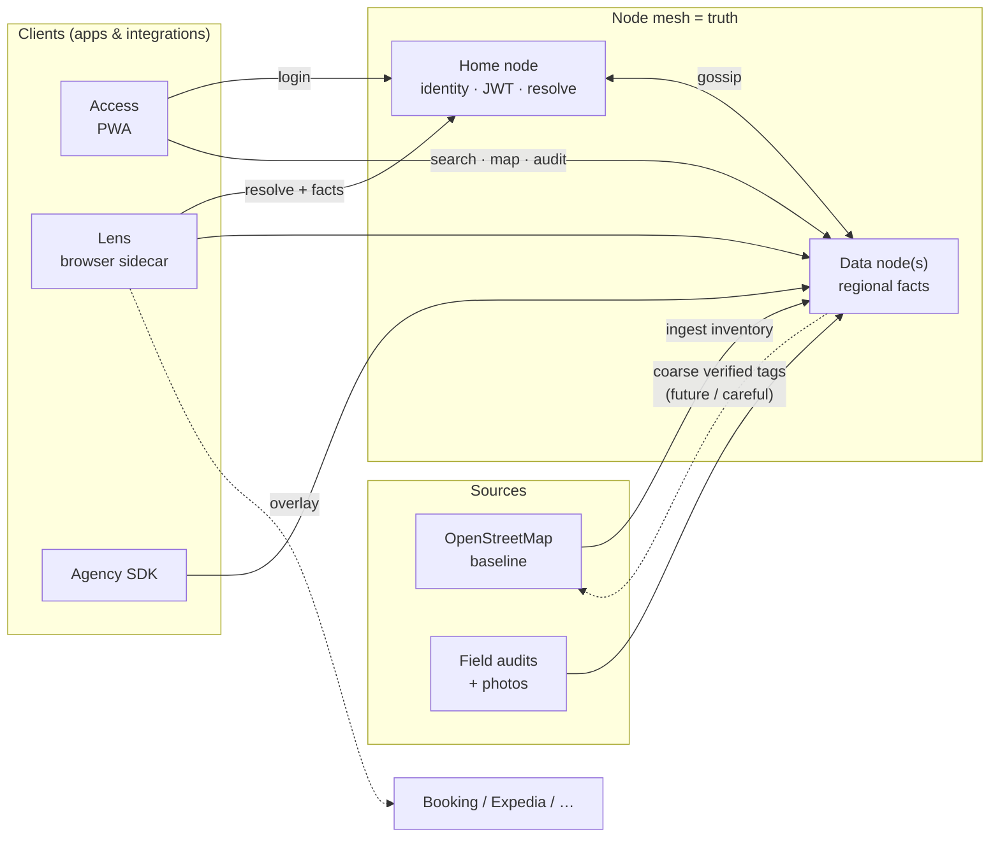

# The hotel said “accessible.” That wasn’t enough.

### A relative told me how miserable booking travel with a wheelchair still is. Curiosity and a UX brain did the rest — then I got sucked into an accidental product once coding stopped being the bottleneck.

---

I didn’t set out to build infrastructure.

I set out to answer a relatively human question that somehow never gets a trustworthy answer when you need it most:

**Is this hotel actually accessible — not “accessible according to a marketing checkbox,” but accessible according to someone who has been there, looked, measured, photographed, and cared?**

That question came from Maurice.

Maurice is my cousin-in-law. He uses a wheelchair. We talked at the funeral of my uncle Jaap. The kind of conversation that sits between grief and ordinary life, where people suddenly tell you the real stuff: booking travel is exhausting when accessibility information is missing, outdated, contradictory, or written by someone who has never pushed a chair through a bathroom doorway.

When a UX engineer hears a problem like that, the head does overtime. You don’t live Maurice’s life. You still have to stand in his shoes long enough to feel the booking flow break: sitting with the tab open, in the chair. Will the entrance actually work? Is the “accessible” room reachable when the lift isn’t? Can you turn in the bathroom, or do you find out the sink blocks the transfer only after you’ve paid and traveled? Search says accessible. The photo omits the doorway. A review says “wheelchair-friendly” like “cozy” — atmosphere, not evidence. Too often: *you won’t know until you’re there.*

When people struggle like that, the system is often lying about complexity. It pretends the workflow is simple. It hides the missing data. It optimizes for the median user and calls the rest an edge case.

Accessibility information for hotels, apartments, and other stays is not an edge case. It’s a trust problem dressed up as a content problem.

That picture has to come first. Only then do the product and engineering questions get real room — what creates value, what scales without lying, what’s feasible to build without up-to-date programming knowledge.

Strong AI models change the tempo: they can implement against a picture you can already hold in your head. The picture is the hard part. The agents type. You’re the conductor — continuously bridging **user → product/value → technique**.

So I did what people with dangerous curiosity always do.

I started building.

I got sucked in anyway. First the data model. Then the sidecar. Then the mesh. Then the monorepo. Then the parts that make a side project start behaving like an accidental product.

And then it got out of hand — in the useful way.

Welcome to WikiTraveler.

This piece is mainly for people who do **UX and product work** and are figuring out what AI-assisted building changes — and what it doesn’t.  
Along the way it should also make sense if you care about **disability and travel access**, **open source commons**, or **shipping weird infrastructure as a side project**.

Different readers can take different exits. Same story.

One vocabulary note before we go on, because “UX” gets abused into meaning “someone made the buttons blue.” **User experience (UX)** is the whole lived path through a product: goals, confusion, trust, dead ends, what happens when the data is wrong. **Usability** is a chunk of that — can someone complete the task without fighting the interface? **UI** is the visible layer: screens, controls, layout. Related; not the same. Product sense asks whether we’re solving the right problem at all. When I say UX in this piece, I mostly mean the *experience of trusting a stay* — journey and information architecture first, pixels second.

---

## The thing that already exists, and why it still fails

Travel platforms are incredible at inventory, pricing, and converting intent into bookings. They are much worse at accessibility as **structured truth over time**.

Maurice often gets a vague icon, a sentence that could mean anything, a filter that doesn’t match the bathroom, or a review that says “accessible” without saying *for whom*. Dedicated sites help — but they don’t fix that gap the same way.

[Wheelchair Travel](https://wheelchairtravel.org/) is strong on advocacy and trip storytelling. Hotel detail often lives in narrative posts, not a living inventory you can trust night after night beside Booking.

[Wheel the World](https://wheeltheworld.com/) is the closest cousin on *data shape*: proprietary AMS, trained mappers, measurements + photos, profiles, and a booking marketplace ([their trust write-up](https://blog.wheeltheworld.com/accessible-hotels-roll-in-showers-at-hotels-everything-you-need-to-know/)). Hotels can buy **Accessibility Verified**. Thin coverage often becomes concierge, not an honest empty map.

That last part is the moral snag for me. The mapping work is real and expensive — I don’t begrudge people getting paid to measure bathrooms. What I resent is turning **whether a stay is actually usable** into proprietary inventory you rent through a marketplace and a B2B seal. That information should be a commons: free to read, free to reuse beside Booking, not a moat. Charge for booking, concierge, or ops if you must. Don’t own the facts of the doorway.

Same hunger for verified structure. Different ownership of the truth:

| | Wheel the World | WikiTraveler |
|--|-----------------|--------------|
| Data | Proprietary AMS — the moat | Open mesh (CC-BY) — not for sale |
| Who maps | Paid mappers; hotels can buy “Verified” | Community (+ firms already walking hotels) |
| Product | Marketplace / concierge | **Sidecar** beside Booking / Expedia |
| Empty city | “Leave your email” | Say it isn’t covered — then fill it |

Commercial AMS will densify *some* cities. An empty open map looks unfinished, not principled. Staying community-owned means refusing to monetize the facts — and making **real audits the whole game** instead. Triage first, deeper packs where people show up. Travelers usually don’t want a segregated travel internet; they want trustworthy facts *where they already book*.

Europe’s **EAA** (mid‑2025) adds pressure. It does not invent that dataset.

So the framing became: treat stay accessibility like a commons — **closer to OpenStreetMap than to a proprietary roadmap**. A **sidecar** that rides next to the giants, enriches or contradicts them, and stays useful even if they ignore it.

OSM maps **where** things are (plus thin wheelchair tags). WikiTraveler is **can you stay and wash here** — audits, photos, trust tiers — on OSM as `OFFICIAL` baseline. We don’t replace the map. Coarse verified signals (`wheelchair=yes|limited|no`) should be able to **flow back**; bed height, roll-in detail, and multi-auditor confirmation stay with us. Commons beside commons.

Not another Booking. Not another accessible-hotels site. Not Wheel the World with a different logo. The truth layer beside the booking journey — and neighbourly to the open map it started from.

---

## Confession: I am not a full-time distributed-systems engineer

I do UX and engineering for work.

That means I spend a lot of time on how complex tools feel to real people: flows, information structure, trust, whether something is usable under pressure — usability inside a broader experience, with UI as one of the instruments. I’ve also been poking at AI-assisted building — not because the model should own the product, but because implementation used to be the tax on having a clear system in your head.

I can prototype. I’m not allergic to code. My programming knowledge is uneven and, in places, outdated. Historically that would have been enough to stop a build like this:

- a federated mesh of nodes
- gossip sync
- RS256 cross-node auth
- OSM ingest
- an audit PWA
- a Chrome extension
- an agency SDK
- Docker + Vercel deployment paths
- release compatibility policy
- SSRF hardening
- and a community model with auditors and operators

…in six months, as a side project.

Which is exactly what happened.

The unpopular opinion worth planting early:

**Outdated coding skills are less of a blocker than people think — if you can hold the system in your head like a board on the wall.**

Journeys. Trust boundaries. Failure modes. What creates value. What’s feasible. What must stay human.

AI doesn’t invent that board.
AI doesn’t invent taste.
AI doesn’t invent the original problem — Maurice did.

What it can offer is **hands at the tempo of thought**.

Agents can assemble a lot of the parts.
Someone still has to hold the picture.
Someone still has to conduct.
The real job is the bridge: **user ↔ product/value ↔ technique** — over and over, every time a system invents a new way to lie.

And throughput, it turns out, is a hell of a drug.

---

## The March manifesto (mostly still true)

On **18 March**, early in the build, I wrote myself a manifesto. It had a version number. It had emoji. It had sentences like “Distributed Truth Layer” and “Community-Owned Certainty.” It was earnest, a little loud, and — looking back — almost awkwardly on target.

The vision, compressed:

> Replace unreliable corporate booking data with a community-driven truth layer. Travelers deserve certainty, not best guesses. Keep insights free, open, and verified by people on the ground — not by whoever is selling the room.

The strategy had five verbs: **Expose → Verify → Decentralize → Gossip → Open-source.**

The toolkit was already named in spirit: **Node**, **Lens**, **Field Kit**, a **gossip** sync, trust tiers from official baseline → AI guess → community verification → multi-party consensus.

What held:

- sidecar, not replacement
- AI estimates guide; they don’t become reality
- field audits as the scarce honest resource
- federated nodes so truth can’t sit behind one paywall
- Lens as the browser overlay
- open protocol / open data instincts (MIT code, CC-BY mesh data)

The interesting part isn’t how many times the manifesto got rewritten.
It’s how much of the early shape survived contact with reality.

---

## What WikiTraveler is (today)

WikiTraveler is an open-source toolkit for **federated accessibility intelligence for travel**.

In human terms:

- **Nodes** hold the truth for geographic regions.
- **Access** is the traveler/auditor web app.
- **Lens** is the Chrome extension that injects community facts into booking sites.
- **SDK** lets agencies and travel products embed or fetch the same data.
- **Core** shared packages define tiers, merge rules, and gossip logic.

<p>
  
  &nbsp;
  
</p>

*Access — mobile and desktop. Same trust model; different viewport.*

Trust is layered on purpose:

| Tier | Meaning |
|------|---------|
| `OFFICIAL` | Baseline from OSM / Wikidata-style sources |
| `AI_GUESS` | Machine estimate to guide auditors — not ground truth |
| `VERIFIED` | A field audit happened |
| `CONFIRMED` | Multiple independent auditors agree |

Higher tiers win on merge.

That one table is the moral of the system.

AI is allowed to help.
AI is not allowed to quietly become reality.

---

## System overview (the napkin version)

The full architecture doc is longer. The useful mental model is short:

**Clients never hold the truth. Regional nodes do — and they gossip.**



| Piece | Job |
|-------|-----|
| **Data node** | Owns properties/facts for a geographic region |
| **Home node** | Registration, JWT, “which data node for this place?” |
| **Access** | Traveler + auditor app |
| **Lens** | Sidecar UX on existing booking sites |
| **SDK** | Embed/fetch the same facts in agency products |


*A real node dashboard. Hundreds of thousands of stays ingested from OSM. Almost all facts still `OFFICIAL`. Audits: basically a rounding error. That gap is the product.*

---

## Sidecar, not destination

This is the UX idea I care about most.

People do not wake up wanting a new travel platform.
They wake up wanting a stay that won’t trap them.

So WikiTraveler is designed as a **sidecar**:

1. **Baseline from the commons** — OpenStreetMap and related open sources give you something to start from.
2. **Truth lives in a mesh** — independent nodes gossip verified facts; no single vendor is required.
3. **Clients consume the mesh** — Access, Lens, SDK.
4. **Existing platforms remain the booking surface** — we overlay, enrich, deep-link, report issues.

Lens is the purest expression of that idea.

You’re on Booking.com / Expedia / Hotels.com.
You hover a listing.
WikiTraveler tries to resolve the property and show accessibility facts from the community mesh.
If the area isn’t covered, it should say so honestly instead of inventing confidence.


*Lens — the sidecar in practice: scores, features, audit photos, without leaving the browsing flow.*

The SDK is the same idea for product teams:

> Don’t rebuild accessibility truth.
> Consume the commons.
> Show it in *your* UX.

If that sounds ambitious: yes.
If that sounds unfinished: also yes.
If that sounds more useful than another closed database of half-true icons: that’s the bet.

---

## The monorepo as autobiography

WikiTraveler lives in one monorepo because the product is one system with multiple faces.

Approximate shape:

```text
apps/node      → API + admin dashboard (the deployment unit)
apps/access    → traveler / auditor PWA
apps/lens      → Chrome extension (sidecar UX)
packages/sdk   → agency / site integration
packages/core  → tiers, merge, gossip logic
packages/ui    → shared interface pieces
packages/i18n  → locales
prisma/        → schema + migrations
docs/          → operators, federation, RFCs, community
```

This is not “I love monorepos.”
This is “shared truth definitions kept accumulating until copy-paste stopped being honest.”

A monorepo forces a useful discipline for vibe-built systems:

- one place for the trust model
- one place for field definitions
- one release story
- one set of docs that can contradict the code less often

Tradeoff: one shared truth model also means one shared blast radius. Break merge logic once, and every client feels it.

---

## How the system was built (in acts)

I won’t pretend this arrived fully formed. It grew in layers — each one solving a real problem, and sometimes creating the next one.

### Act I — Inventory without renting the universe

First problem: where do the stays come from?

The March manifesto still assumed **Amadeus** as the official baseline to “expose” vague corporate tags. I started there because it looked like a sensible property feed. Then the self-service developer portal was gone: decommissioned on **17 July** (their announcement), with only the Enterprise API path remaining — request access, sandbox, travel consultants, commercial offers. For a side project that wants open, keepable inventory, that’s a dead end. So I ripped the dependency out and went looking for a baseline I could keep building on without a sales conversation every time the wind changed.

That search landed on **OpenStreetMap** (plus related open sources like Wheelmap ideas early on).

OSM didn’t just replace a feed. It pushed the product toward commons thinking:

- start from open map data
- enrich with people who actually visit
- distribute the result
- ride beside booking platforms instead of becoming one
- eventually give **coarse** verified wheelchair signals back to OSM where they belong — and keep stay-depth (photos, measurements, trust tiers) in WikiTraveler

Around the same time I sketched the first **Lens** idea (show facts on top of existing sites) and poked at federation experiments that didn’t all survive. The important leftover: **the data layer should be open and ownable** — and neighbourly to the commons it already leans on, not a one-way extract.

### Act II — One node isn’t a world

Second problem: a single server can’t honestly cover the planet, and a central “node registry” is still a soft monopoly.

So the system grew a **mesh**:

- regional **data nodes** own facts for a geographic area
- clients ask “which node is responsible for here?”
- nodes **gossip** deltas to peers
- bootstrap peers help a new node find the network

I did try the obvious shortcut first: a central registry. It felt orderly. It was also the wrong shape for a commons. Killing it forced the real design: peer discovery, geographic resolve, and federation that doesn’t need a king.

### Act III — Make it usable for travelers and auditors

Third problem: infrastructure without a product is a science fair.

The traveler/auditor app started life as **Field Kit** — a name that sounded like specialist gear. The product needed to serve travelers *and* people doing audits. Renaming it to **WikiTraveler Access** wasn’t cosmetics; it changed who the system claimed to be for.

Access grew into the main human interface:

- search / map / list
- property detail with trust-aware facts
- favorites and contribute flows
- a structured **audit wizard** with photos attached to steps and room types

The **monorepo** showed up here for a boring reason: Node, Access, Lens, and the SDK all need the same truth definitions. One trust model. One field catalog. One shared blast radius: break merge logic once, and every client feels it.

### Act IV — Make it safe enough to share

Fourth problem: once peers fetch peers, and JWTs cross nodes, and photos get uploaded, “it works on my laptop” stops being a strategy.

So the build shifted from features to **operability**:

- Docker / Vercel deploy paths
- rate limits and AI cost controls
- photo storage adapters
- gossip compatibility checks
- SSRF guards on peer fetches
- dependency / CodeQL hygiene
- release versioning so operators aren’t forced into day-zero upgrades

This is where vibe-built software either grows up or stays cosplay. Accessibility data can affect real travel decisions. That raises the bar.

### Act V — Hide the mesh from travelers

Fifth problem: federation is only useful if normal people don’t have to understand it.

**RFC-0002 / hub Access** is the product answer:

- one Access experience worldwide
- **home node** = identity
- **data node** = facts for the place you’re looking at
- Lens and SDK follow the same resolve pattern
- if an area isn’t covered, say so — don’t fake completeness

That’s the system as it stands around **v0.5.x**: not finished, but shaped. Sidecar clients on the outside. A gossiping mesh on the inside. OSM as baseline. Audits as the scarce resource that actually creates trust.

---

## UX is still the center of gravity

The project keeps getting dragged back to journeys — the lived path through trust and coverage, not just screens.

### Traveler journey

1. Open Access (or use Lens on a booking site).
2. Search / map / nearby.
3. See facts with trust tiers.
4. Save places.
5. Report issues when reality disagrees with the database.
6. Get an honest “this area isn’t covered yet” when that’s the case.

### Auditor journey

1. Become an auditor (trust is intentional, not ambient).
2. Run a structured field audit.
3. Attach photos to **steps / room types**, not random floating tags.
4. Submit verified facts.
5. Watch tiers rise as independent confirmation accumulates.

### Operator journey

1. Stand up a node (Docker or Vercel).
2. Ingest a region.
3. Allow trusted client origins.
4. Peer with the mesh.
5. Upgrade on your own schedule within compatibility policy.

### Agency / platform journey

1. Use the SDK or APIs.
2. Show community facts in your own UI.
3. Deep-link into Access for detail / reporting.
4. Don’t pretend proprietary silence is the same as safety.

If those journeys are confusing, the architecture is wrong — no matter how elegant the gossip looks in a diagram.

---

## Vibe coding, but with adult supervision

There’s a lot of discourse about vibe coding.

Some of it is fair.
Some of it is people defending their identity as “real engineers” against a scary new productivity curve.
Some of it is warnings I agree with: if you can’t read diffs, you will ship haunted houses.

The experience is less ideological and more practical.

You can imagine a system from a handful of ideas.
You can hold the user model, the trust model, and the deployment model in your head.
You can tell when an AI suggestion is locally clever and globally stupid.
You still need help turning that mental picture into thousands of coherent lines across apps, packages, tests, docs, and CI.

So you collaborate with agents.

Hard.

Intent gets described.
The agent explores the monorepo.
You argue via diffs.
You redirect when the system drifts.
Security findings get fixed.
Operator docs get written.
Yesterday’s registry idea turns out to be a trap.
Field Kit becomes Access — because travelers aren’t a “kit.”
Another release candidate ships that is somehow both more serious and more unfinished.

The scarce skill isn’t coding speed.
It’s knowing what *not* to ship when agents can generate almost anything.

Can you keep judgment sharp when building suddenly got cheap?

That is the new UX systems problem.

---

## Community is the actual product

Here’s the part where the engineer ego needs to sit down.

The code is not the hard part anymore.

The hard part is filling the system with **reliable accessibility information** and keeping it trustworthy.

WikiTraveler only works if several kinds of humans show up:

### 1. Travelers
People who browse, save, notice gaps, and report when reality disagrees with the map.

### 2. Auditors
People who go on-site and create verified evidence: structured facts, photos, notes, judgment. Without them the mesh is a fancy mirror of OSM tags and AI guesses.

The cold-start risk: **thin verified density doesn’t fail loudly — it just never becomes useful.** Empty tiers → no travelers → no auditors → no coverage. Paid AMS densifies *some* cities; the open bet only works if community (and firms already walking hotels) fill enough places that the sidecar feels real. As the product, not a later metric.

OSM is inventory, not Maurice’s bathroom. When audits land, coarse tags should be able to flow back to OSM/Wheelmap; stay-depth stays here. Empty regions say they’re empty. Every real audit counts.

If you already inspect hotels or travel with access needs: you’re not optional — you’re the difference between infrastructure and a demo. Public signup is off while this is a controlled test; reach out via GitHub and I’ll create accounts, set roles, and walk you through audits.

### 3. Hotel owners — and firms that already audit hotels
You’re often already on-site for brand standards, safety, quality, OTA readiness, or mystery shopping. Accessibility facts are usually a thin afterthought — or missing.

The challenge is simple: **take accessibility with you on the next visit**, capture structured facts and photos, and let that land in WikiTraveler as community-owned evidence instead of another closed PDF. Professional auditors who already walk the corridors can add accessibility to the checklist without inventing a second industry.

Independence matters. **Butchers don’t grade their own meat.** A hotel marking itself “fully accessible” is marketing until someone independent has been there. Owners are still essential — open the doors, share plans, host auditors, fix what’s wrong — but verified facts should come from people who aren’t selling the room. WikiTraveler’s trust tiers exist partly for that reason: self-interest and ground truth are not the same job.

If you already measure hotels for other reasons, measuring step-free access, bathrooms, lifts, and room usability is not “extra product.” It’s the difference between a listing that looks fine and a stay someone like Maurice can trust.

### 4. Node operators — and serious hosting
People willing to run sovereign regional infrastructure.
Not because decentralization is trendy, but because a global accessibility commons shouldn’t depend on one company’s uptime and moderation mood.

That includes the public hub. Free / hobby-class Vercel was the right way to *start*. It is the wrong way to *stay*. Travelers and auditors need boring, adult infrastructure: high-performance hosting for hub Access and reference nodes, room for map/search load, photo traffic, gossip, and uptime that doesn’t evaporate when a free tier blinks. Community fills the facts. Operators and hosting keep the door open.

### 5. Integrators
Agencies and travel products that embed the SDK / consume APIs and put the data where decisions happen.

### 6. (Vibe) developers
People who can help evolve the toolkit: Access UX, Lens behavior, gossip hardening, i18n, region presets, tests, docs.

### 7. Security-minded contributors
Because a federated system that handles identity, peer fetches, uploads, and public clients will attract the wrong kind of curiosity eventually.
Better to invite the right kind first.

The commons needs all of them.

Not as “users of a side project.”
As co-owners — which is where something stops being only one person’s build and starts behaving like an accidental product.

---

## Why reliability beats cleverness

If WikiTraveler tells Maurice a bathroom is accessible and it isn’t, that is not a bug in a backlog.

That is a broken promise with physical consequences.

So the system is biased toward:

- explicit trust tiers
- independent confirmation
- photo evidence attached to meaningful audit steps
- coverage honesty over fake completeness
- operator sovereignty over forced upgrades
- RFCs for federation-impacting changes
- security checks in CI, not as folklore

Is it perfect? No.
Is there a public Access URL? Yes — [https://access.wikitraveler.org](https://access.wikitraveler.org) — but **registration is off** right now. This is still a controlled test setup, not an open signup product. You can read the repo and docs, judge the architecture, and tell me where I’m wrong. If you want a hands-on look (auditor, operator, or sharp reviewer), reach out via GitHub.

Repo: [https://github.com/ingmarstruijs/WikiTraveler](https://github.com/ingmarstruijs/WikiTraveler)

I want the kind of feedback that stings productively.

Especially from people who travel with accessibility constraints.
Especially from people who have tried to maintain community data before.
Especially from people who look at federation and say: “cute, now show me the failure modes.”

---

## What this built taught (without the TED Talk polish)

### 1. A clear mental model beats a perfect initial stack
The design moved left to right. Amadeus-until-self-service-died, OSM, central registry, peer mesh, Field Kit, Access, hub routing — some of the best instincts arrived as workarounds. The surviving ideas — sidecar, commons, trust tiers, honest coverage — were less “designed on day one” and more “what remained after reality edited the plan.”

### 2. Agents make wrong paths ship fast — so killing them becomes the work
Locally coherent ideas are easy to generate now. The useful skill isn’t producing more surface area; it’s noticing when a path fights the product and deleting it before it hardens into “the product.”

### 3. Renames are architecture
Naming isn’t cosmetics. A rename forces a clearer claim about who the system is for and what it is allowed to become — and that clarity is what lets the next design decisions land.

### 4. Security work is community work
SSRF guards, dependency pins, trusted CORS for hub clients — these are how you respect operators and travelers you haven’t met yet.

### 5. Docs are part of the UX
Operator guides, RFCs, upgrade runbooks, community roles: if only one person understands the mesh, it isn’t a mesh. It’s a science project with a domain name.

### 6. Code without coverage is still vapor
Nodes can ship forever. If verified facts don’t accumulate in real regions, WikiTraveler remains a well-documented empty room. That risk is real. Naming it is part of taking the problem seriously.

---

## Why you might care even if you’ll never run a node

Because this pattern is bigger than hotels.

Lots of domains have the same shape:

- big platforms own the transaction surface
- critical contextual truth is under-modeled
- communities know more than databases admit
- AI can estimate, but shouldn’t silently become authority
- the useful system may be a sidecar, not a replacement

Accessibility for stays is just an unusually concrete version of that pattern, with unusually high human stakes.

Also, if you do UX or product work and you’ve been told your technical knowledge is “too outdated” for modern building: maybe.
Or maybe your advantage is exactly that you still think in journeys, trust, and system boundaries — and now the implementation bottleneck is negotiable.

Not everyone should vibe-build a federated mesh.
This one happened accidentally. The half-finished acts are both evidence and comedy.

---

## An invitation, not a victory lap

WikiTraveler is still a side project that grew teeth.

It is also, increasingly, an accidental product: releases, compatibility policy, operator docs, and a community-shaped hole waiting to be filled with real audits — or, if that hole stays empty, a toolkit that never earns the name “product.”

Shipping code with agents isn’t the point.

If this resonated, the useful next steps are simple:

1. **Read** the repo docs if you want the technical deep dive.  
2. **Judge** the screenshots and architecture honestly — registration on Access is off while this stays a controlled test.  
3. **Share** with someone who books accessible travel, builds travel products, owns or audits hotels, or likes open commons.  
4. **Think with me** out loud: what’s wrong, what’s missing, what would make trust real.  
5. **Join** if you want to help: build, audit, operate a node, integrate the SDK, harden security, help stand up serious hosting — or if you already inspect hotels for other reasons, start bringing accessibility facts into the commons. Start from GitHub.

Where help still moves the needle:

- sharpening the audit flow as more real visits happen
- growing coverage beyond OSM baseline in real regions
- hotel owners and professional hotel auditors adding accessibility to visits they already make
- a careful write-back path for coarse verified wheelchair tags into OpenStreetMap
- making trust tiers obvious at a glance in Access and Lens
- getting Lens in front of people who already book on OTAs
- making the SDK the easy default for agencies that want the commons
- more eyes on security as the mesh grows
- clearer onboarding for people who want to run a node — and moving the public hub off free Vercel onto serious hosting
- healthier ways to challenge a fact without burning the commons

Human test: would this have helped someone like Maurice the last time they tried to book a stay?

Shortest summary:

**The goal was what Maurice described — trustworthy accessibility facts for stays — via open data (beside OSM, not against it), a sidecar UX strategy instead of a proprietary marketplace, and AI-accelerated building. What exists now is a monorepo, a federated mesh, a browser extension, an SDK, too many architectural U-turns, and a clearer respect for how hard that information is.**

That’s the project.  
That’s the lesson.  
That’s the ask.

Read it. Share it if it’s useful. Tell me where I’m wrong.  
And if you want to help make the data real — welcome.

---

### Publish-ready links

- GitHub: https://github.com/ingmarstruijs/WikiTraveler  
- Access (hub URL; registration currently off): https://access.wikitraveler.org  
- Docs hub: https://github.com/ingmarstruijs/WikiTraveler/blob/main/docs/README.md  

---

*Audience note: primary readers = UX/product people exploring AI-assisted building; secondary = a11y/disability, OSS/dev, travel tech. Channels: Medium, LinkedIn, Hacker News, plus disability / open-source / developer forums. CTA: read, share, think along, contribute (build / audit / run nodes / integrate). Suggested tags: `#accessibility` `#opensource` `#ux` `#a11y` `#traveltech` `#federation` `#vibecoding` `#community`. Estimated reading time: ~18–22 minutes.*

**Images:** linked relatively from this file as `../assets/screenshots/` (`access-mobile.png`, `access-desktop.jpg`, `lens.png`, `node-admin.png`). On GitHub they render from the repo. For Medium/LinkedIn, upload those same files and swap in CDN URLs. Mermaid renders on GitHub; on Medium, paste a diagram screenshot if needed.

---

## Platform captions (copy/paste)

### LinkedIn

The hotel said “accessible.” That wasn’t enough.

I’m a UX engineer. When Maurice — my cousin-in-law, who uses a wheelchair — described how miserable booking a trip with a wheelchair still is, curiosity and a UX brain did the rest. The old blocker was implementation bandwidth and rusty coding fluency. Strong AI models changed that. I got sucked into a side project that began behaving like an accidental product: federated mesh, browser sidecar, agency SDK.

I wrote up what I learned — including how the system grew in messy acts, the Amadeus → OpenStreetMap pivot, why we’re a sidecar commons rather than Wheel the World’s marketplace, and why reliable data matters more than clever code:

[LINK TO ARTICLE]

If this resonates: read the repo, share it with someone who books accessible travel, owns or audits hotels, or builds products — tell me where I’m wrong, or help by building, auditing, running a node, or hosting. Especially if you already walk hotels for brand/safety/quality: bring accessibility into those visits so the facts can land in WikiTraveler. (Public Access signup is off for now; start at GitHub.)

Repo: https://github.com/ingmarstruijs/WikiTraveler  
Access (registration off): https://access.wikitraveler.org

#accessibility #ux #opensource #a11y #vibecoding

---

### Medium (subtitle + deck)

**Subtitle:** A relative told me how miserable booking travel with a wheelchair still is. Curiosity and a UX brain did the rest — then I got sucked into an accidental product once coding stopped being the bottleneck.

**Deck / intro blurb:**  
I’m not a distributed-systems engineer by trade — I do UX and engineering for work. After a conversation with Maurice about booking accessible stays, I started a sidecar-style open project on top of travel platforms. This is the honest story of what got built, what got thrown away, and why community trust matters more than the code.

---

### Hacker News (title + comment)

**Title options (pick one):**
1. WikiTraveler: accidental federated accessibility data mesh for hotels (OSS)
2. Show HN: WikiTraveler – community accessibility facts as a sidecar to Booking/Expedia
3. I vibe-coded a federated accessibility commons for travel stays – ask me anything-ish

**First comment (recommended for Show HN / discussion):**  
Family conversation → “accessible hotel info is unreliable” → tried Amadeus → self-service developer portal decommissioned (enterprise-only left) → moved to OpenStreetMap → somehow ended up with a monorepo, gossip mesh, audit PWA, Chrome extension (Lens), and an agency SDK.

Same hunger for verified structure as Wheel the World; different bet: open CC-BY mesh + sidecar beside Booking, not a proprietary AMS marketplace. OSM as baseline (and eventually coarse verified tags back); stay-depth stays in WikiTraveler.

I’m closer to UX/engineering than to “I meant to invent federation.” Happy to talk about trust tiers, sidecar UX, security, or where this is still naive.

Repo: https://github.com/ingmarstruijs/WikiTraveler  
Access (registration currently off): https://access.wikitraveler.org  
Article: [LINK]

---

### Disability / a11y forums

Short version:  
My cousin-in-law Maurice uses a wheelchair and described how hard it is to find up-to-date accessibility information for hotels and other stays. I built an open, community-oriented prototype (web app + browser extension) that starts from open map data and is meant to be enriched by real audits and photos — not marketing checkboxes.

I’d love honest feedback from people who actually travel with accessibility needs: Does this solve a real problem, or the wrong one? Public signup is off while it’s a controlled test — GitHub issues / discussion welcome.

Access (registration off): https://access.wikitraveler.org  
Article: [LINK]  
Repo: https://github.com/ingmarstruijs/WikiTraveler

---

### Dev / open-source forums

Built an MIT/CC-BY toolkit for federated accessibility facts about stays: regional nodes, gossip sync, trust tiers (OSM → AI guess → verified audit → multi-auditor confirmed), Access PWA, Lens extension, agency SDK.

Looking for contributors, auditors, and node operators — and sharp critique on the architecture.

Article: [LINK]  
Repo: https://github.com/ingmarstruijs/WikiTraveler

